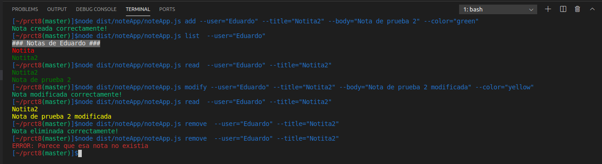

# Práctica 8 - Aplicación de procesamiento de notas de texto
* Elaborado por Eduardo Da Silva Yanes

## Indice
- [1. Introduccion](#introduccion)
- [2. Pasos previos](#previos)
- [3. Desarrollo de los ejercicios](#desarrollo)
- [4. Dificultades y conclusion](#conclusion)
- [5. Referencias](#referencias)

## 1. Introducción <a name="introduccion"></a>
Esta octava práctica será la primera donde hagamos algo más cercano a lo que es una aplicación real. En este caso vamos a aprender cómo usar la API síncrona de Node.js así como otras herramientas como yargs para interactuar con argumentos de la linea de comandos y chalk, que nos permite añadir un color al output de la terminal.

Además de todo el código a desarrollar, también vamos a trabajar con Github Actions y la integración continua. Tendremos ejecución continua de código TS ejecutado en Node.js y configuracioń del flujo de trabajo para trabajar con Coveralls y SonarCloud.

## 2. Pasos previos <a name="previos"></a>
Para la realización de esta práctica necesitaremos hacer uso de distintos paquetes que instalaremos a continuación.
Recordemos siempre instalar las cosas como dependencias de desarrollo. Para ello hacemos uso del flag `--save-dev`.

Para poder aprovechar la **api síncrona de Node.JS para trabajar con ficheros** debemos instalar el siguiente paquete:
```bash
npm install --save-dev @types/node
```
Para instalar **chalk** debemos hacer lo siguiente:
```bash
npm install --save-dev chalk
```
Finalmente necesitamos instalar **yargs**. Para ello debemos instalar tanto el propio yargs como el paquete **@types/yargs**. 
```bash
npm install --save-dev yargs @types/yargs
```

## 3. Desarrollo de los ejercicios <a name="desarrollo"></a>

- **[Enlace al código fuente](https://github.com/ULL-ESIT-INF-DSI-2021/ull-esit-inf-dsi-20-21-prct08-filesystem-notes-app-EduardoSY/tree/master/src/noteApp)**

- **[Enlace a los tests](https://github.com/ULL-ESIT-INF-DSI-2021/ull-esit-inf-dsi-20-21-prct08-filesystem-notes-app-EduardoSY/tree/master/tests/noteApp_test)**

- **[Enlace a la documentación generada](https://ull-esit-inf-dsi-2021.github.io/ull-esit-inf-dsi-20-21-prct08-filesystem-notes-app-EduardoSY/docum/index)**


Para llevar a cabo esta práctica he creado diversas clases.

### Clase Note

Esta clase es la encargada de representar lo que es una nota.  

```typescript
export class Note {
  private color: string;
  private possibleColors: string[] = ['red', 'yellow', 'blue', 'green'];
  constructor(private title: string, private body: string,
    private color: string) {
    try {
      if (!this.possibleColors.includes(colorsito)) {
        this.color = 'red';
        throw new Error('El color no era valido asi que'+
        ' pondremos el rojo por defecto');
      } else {
        this.color = colorsito;
      }
    } catch (err) {
      console.log(chalk.red(err.message));
    }
  }

  setTitle(title: string): void {
    this.title = title;
  }

  setColor(color: string): void {
    this.color = color;
  }

  setBody(body: string): void {
    this.body = body;
  }

  getTitle():string {
    return this.title;
  }

  getColor():string {
    return this.color;
  }

  getBody():string {
    return this.body;
  }

  noteToJSON():string {
    return '{\n\"title\": \"' + this.title + '\",\n\"body\": \"'+ this.body +
    '\",\n\"color\": \"' + this.color + '\"\n}';
  }
}
```
Una nota está compuesta por un **título**, un **cuerpo**, es decir, un mensaje y por un **color**. 

Para poder acceder a todos estos atributos tenemos sus correspondientes **getters** así como sus **setters**, en caso de que querramos modificar alguno de estos.

Finalmente tenemos la función `noteToJSON()`. El objetivo de esta es transformar la nota a formato JSON de tal manera que lo podemos almacenar en un fichero y poder manipularla correctamente.

### Clase userNoteOptions

El objetivo de esta clase es englobar todo aquello que el usuario puede hacer con las notas. Esto incluye añadir notas, eliminarlas, modificarlas, leerlas y listarlas.

```typescript
import {Note} from './note';
import * as fs from 'fs';
import * as chalk from 'chalk';


export class UserNoteOptions {
  constructor() {}

  addNote(usuario: string, titulo: string, cuerpo: string,
      color: string): void {
    try {
      // Si el directorio del usuario no existe se crea
      if (fs.existsSync(`db/${usuario}`) == false) {
        console.log('Creado fichero del usuario');
        fs.mkdirSync(`db/${usuario}`, {recursive: true});
      }
      const nota = new Note(titulo, cuerpo, color as colors);
      if (fs.existsSync(`db/${usuario}/${titulo}.json`) == false) {
        fs.writeFileSync(`db/${usuario}/${titulo}.json`, nota.noteToJSON());
        console.log(chalk.green('Nota creada correctamente!'));
      } else {
        throw new Error('ERROR: Parece que ya existe'+
        ' una nota con el mismo titulo');
      }
    } catch (err) {
      console.log(chalk.red(err.message));
    }
  }

  removeNote(usuario: string, titulo: string): void {
    try {
      if (fs.existsSync(`db/${usuario}/${titulo}.json`) == true) {
        fs.rmSync(`db/${usuario}/${titulo}.json`);
        console.log(chalk.green('Nota eliminada correctamente!'));
      } else {
        throw new Error('ERROR: Parece que esa nota no existia');
      }
    } catch (err) {
      console.log(chalk.red(err.message));
    }
  }

  modifyNote(usuario: string, titulo: string, cuerpo: string,
      color: string): void {
    try {
      if (fs.existsSync(`db/${usuario}/${titulo}.json`) == true) {
        const nota = new Note(titulo, cuerpo, color as colors);
        fs.writeFileSync(`db/${usuario}/${titulo}.json`, nota.noteToJSON());
        console.log(chalk.green('Nota modificada correctamente!'));
      } else {
        throw new Error('ERROR: Parece que esa nota no existe');
      }
    } catch (err) {
      console.log(chalk.red(err.message));
    }
  }


  listNotes(usuario: string): Note[] {
    let listNotes: Note[] = [];
    fs.readdirSync(`db/${usuario}`).forEach((notes) => {
      const info = fs.readFileSync(`db/${usuario}/${notes}`);
      const notaJson = JSON.parse(info.toString());
      const nota = new Note(notaJson.title, notaJson.body, notaJson.color);
      listNotes.push(nota);
    });
    return listNotes;
  }

  readNote(usuario: string, titulo: string): void {
    try {
      if (fs.existsSync(`db/${usuario}/${titulo}.json`) == true) {
        const info = fs.readFileSync(`db/${usuario}/${titulo}.json`);
        const notaJson = JSON.parse(info.toString());
        const nota = new Note(notaJson.title, notaJson.body, notaJson.color);
        return nota;
      } else {
        throw new Error('ERROR: Parece que esa nota no existe');
      }
    } catch (err) {
      console.log(chalk.red(err.message));
    }
  }
}
```

En primer lugar importamos todo aquello externo que vamos a necesitar. En nuestro caso es **chalk** y el paquete **fs** para la gestión de fichero así como la clase **Note** creada anteriormente.

**`addNote(usuario: string, titulo: string, cuerpo: string, color: string)`** es la primera función que encontramos. Esta nos permite añadir una nueva nota. 

Lo primero que hacemos es analizar si existe el directorio correspondiente al usuario. En caso negativo, creamos dicho directorio. A continuación se analiza si existe un fichero .json con el mismo nombre que la nota que vamos a crear. En caso afirmativo mostramos por consola un mensaje de error. En caso contrario, creamos dicho directorio gracias a la función `writeFileSync`, que recibe tanto la ruta como el contenido del fichero, es decir la nota en formato json.

**`removeNote(usuario: string, titulo: string)`** nos permite eliminar una nota existente. 

Lo primero que hacemos es comprobar si la nota que queremos eliminar existe. Si es así, gracias a la función de la api de Node.js, `rmSync`, podemos eliminar el fichero. En caso de que no exista mostramos un mensaje de error por la consola.

**`modifyNote(usuario: string, titulo: string, cuerpo: string, color: string)`** es la función que nos permite modificar nuestras notas. La implementación es muy similar a la de la función **add**. En este caso, lo que hacemos es sobreescribir la nota con los nuevos datos de tal manera que, si la nota ya existia, la modificamos y, en caso de no existir, se envia un mensaje de error.

**`listNotes(usuario: string): Note[]`** nos permite listar todas las notas de un usuario.

Lo que hacemos es recorrer el directorio del usuario en busca de todos los ficheros, abrimos cada uno de los ficheros de las notas y obtenemos la información, pasandola de formato Json a string, para así poder crear una nota con la información que acabamos de procesar.

Cada una de estas notas la guardamos en un array de Note que será devuelto.

**`readNote(usuario: string, titulo: string)`** nos permite leer una nota, mostrando tanto tanto su titulo como su contenido.

Primero comprobarmos que exista la nota solicitada. Si esta existe, se accede al fichero JSON y se obtienen los datos. Estos se transforman a un string y, tras crear una nota con estos datos, los mostramos por consola.

En caso de que la nota no exista se muestra un mensaje de error.


### Clase noteApp

Esta clase es la que crea la interacción con la linea de comandos y los argumentos.

```typescript
import * as chalk from 'chalk';
import * as yargs from 'yargs';
import {Note} from './note';
import {UserNoteOptions} from './userNoteOptions';

const noteOpt = new UserNoteOptions();
yargs.command({
  command: 'add',
  describe: 'Add a new note',
  builder: {
    user: {
      describe: 'User name',
      demandOption: true,
      type: 'string',
    },
    title: {
      describe: 'Note title',
      demandOption: true,
      type: 'string',
    },
    body: {
      describe: 'Note body',
      demandOption: true,
      type: 'string',
    },
    color: {
      describe: 'Note color',
      demandOption: true,
      type: 'string',
    },
  },
  handler(argv) {
    if (typeof argv.user === 'string' && typeof argv.title === 'string' &&
    typeof argv.body === 'string' && typeof argv.color === 'string') {
      noteOpt.addNote(argv.user, argv.title, argv.body, argv.color);
    } else {
      console.log(chalk.red('ERROR: Argumentos no validos'));
    }
  },
});

yargs.command({
  command: 'remove',
  describe: 'Remove a note',
  builder: {
    user: {
      describe: 'User name',
      demandOption: true,
      type: 'string',
    },
    title: {
      describe: 'Note title',
      demandOption: true,
      type: 'string',
    },
  },
  handler(argv) {
    if (typeof argv.user === 'string' && typeof argv.title === 'string') {
      noteOpt.removeNote(argv.user, argv.title);
    } else {
      console.log(chalk.red('ERROR: Argumentos no validos'));
    }
  },
});

yargs.command({
  command: 'modify',
  describe: 'Modify a note',
  builder: {
    user: {
      describe: 'User name',
      demandOption: true,
      type: 'string',
    },
    title: {
      describe: 'Note title',
      demandOption: true,
      type: 'string',
    },
    body: {
      describe: 'Note body',
      demandOption: true,
      type: 'string',
    },
    color: {
      describe: 'Note color',
      demandOption: true,
      type: 'string',
    },
  },
  handler(argv) {
    if (typeof argv.user === 'string' && typeof argv.title === 'string' &&
    typeof argv.body === 'string' && typeof argv.color === 'string') {
      noteOpt.modifyNote(argv.user, argv.title, argv.body, argv.color);
    } else {
      console.log(chalk.red('ERROR: Argumentos no validos'));
    }
  },
});

yargs.command({
  command: 'read',
  describe: 'Read a note',
  builder: {
    user: {
      describe: 'User name',
      demandOption: true,
      type: 'string',
    },
    title: {
      describe: 'Note title',
      demandOption: true,
      type: 'string',
    },
  },
  handler(argv) {
    if (typeof argv.user === 'string' && typeof argv.title === 'string') {
      let nota = noteOpt.readNote(argv.user, argv.title);

      if (nota instanceof Note) {
        console.log(chalk.keyword(nota.getColor())(nota.getTitle()));
        console.log(chalk.keyword(nota.getColor())(nota.getBody()));
    } else {
      console.log(chalk.red('ERROR: Argumentos no validos'));
    }
  },
});

yargs.command({
  command: 'list',
  describe: 'List all note',
  builder: {
    user: {
      describe: 'User name',
      demandOption: true,
      type: 'string',
    },
  },
  handler(argv) {
    if (typeof argv.user === 'string') {
      const notas: Note[] = noteOpt.listNotes(argv.user);
      console.log(chalk.bgGray.white('### Notas de ' + argv.user + ' ###'));
      notas.forEach((nota) => {
        console.log(chalk.keyword(nota.getColor())(nota.getTitle()));
      });
    } else {
      console.log(chalk.red('ERROR: Argumentos no validos'));
    }
  },
});


yargs.parse();
```

Como de costrumbre, las primeras lineas del fichero hacen referencia a las dependencias, librerias o clases u objetos que debemos importar para utilizar en nuestro código.

A continuación definimos los posibles comandos que admitirá nuestro programa gracias al módulo yargs.

Un comando se define env base a la siguiente estructura:

```typescript
yargs.command({
  command: 'add',
  describe: 'Add a new note',
  builder: {
    title: {
      describe: 'Note title',
      demandOption: true,
      type: 'string',
    },
  },
  handler(argv) {
    if (typeof argv.title === 'string') {
      // Required logic to add a new note
    }
  },
});
```

En **command** y **describe** definimos el nombre y una pequeña descripción del comando respectivamente. En la parte de **builder** definimos los argumentos necesarios para dicho comando. Podemos encadenar tantos como sea necesario. Algo muy importante es el atributo **demandOption**, que indica si es obligatorio o no.

Entonces, debido a que la estructura es la misma, explicaré el comando **add**.

En el comando le indicamos que queremos 4 parámetros: user, title, body y color. Todos estos son requeridos.

En caso de que falte alguno de estos argumentos el propio yargs implementa una especie de ayuda indicando las opciones que tiene el comando y cuál es el motivo del error.

A continuación manejamos los datos recibidos como parámetros. Comprobamos que todos sean del tipo que queremos. Si son string, llamamos a la función de añadir nota. En caso de que no sea así, mostramos un error por consola.

### Ejemplo de ejecución



### Tests

En esta práctica, al igual que las anteriores, se ha seguido una metodología TDD. Por tanto, hemos ido creando los tests y posteriormente el código que así resuelve.

Este es **[el directorio con los tests del programa](https://github.com/ULL-ESIT-INF-DSI-2021/ull-esit-inf-dsi-20-21-prct08-filesystem-notes-app-EduardoSY/tree/master/tests/noteApp_test)**

### Workflow con Github Actions e integración continua

Para realizar toda la integración con Github Actions se ha seguido los tutoriales proporcionador por el profesor.

**[CI de código Typescript ejecutado en Node.js (Solo alumnos ULL)](https://drive.google.com/file/d/1hwtPovQlGvthaE7e7yYshC4v8rOtLSw0/view)**

En este primer tutorial creamos la configuración para ejecutar el código y las pruebas en distintas versiones de Node.js y comprobar su correcto funcionamiento. Al finalizar el tutorial nos queda un fichero similar al siguiente:

```
name: Tests

on:
  push:
    branches: [ master ]
  pull_request:
    branches: [ master ]

jobs:
  build:

    runs-on: ubuntu-latest

    strategy:
      matrix:
        node-version: [14.x, 15.x]
        # See supported Node.js release schedule at https://nodejs.org/en/about/releases/

    steps:
    - uses: actions/checkout@v2
    - name: Use Node.js ${{ matrix.node-version }}
      uses: actions/setup-node@v2
      with:
        node-version: ${{ matrix.node-version }}
    - run: npm install
    - run: npm test
```
En este caso se ha eliminado el uso de las versiones 10.x y 12.x debido a que estas no funcionan correctamente con el paquete **fs**. Ciertas funciones como `mkdirSync`, entre otras, dan error puesto que no las reconoce.

**[Workflow GH Actions Coveralls (Solo alumnos ULL)](https://drive.google.com/file/d/1yOonmpVbOyvzx3ZbXMQTAPxvA3a7AE7w/view)**

Una vez finalizado el tutorial, en nuestro directorio `.github/workflows` tendremos nuestro fichero `coveralls.yml` que será similar a esto:

```
name: Coveralls

on:
  push:
    branches: [ master ]
  pull_request:
    branches: [ master ]

jobs:
  coveralls:

    runs-on: ubuntu-latest


    steps:
    - name: Cloning repo
      uses: actions/checkout@v2
    - name: Use Node.js 15.x
      uses: actions/setup-node@v2
      with:
        node-version: 15.x
    - name: Installing dependencies
      run: npm install
    - name: Generating coverage info
      run: npm run coverage
    - name: Coveralls GH action 
      uses: coverallsapp/github-action@master
      with: 
        github-token: ${{secrets.GITHUB_TOKEN}}
```

**[Workflow GH Actions Sonar-Cloud (Solo alumnos ULL)](https://drive.google.com/file/d/1FLPargdPBX6JaJ_85jNsRzxe34sMi-Z3/view)**

Una vez finalizado este ultimo tutorial, en nuestro directorio `.github/workflows` tendremos nuestro fichero `coveralls.yml` que será similar a esto:

```
name: Sonar-Cloud
on:
  push:
    branches: [master]
  pull_request:
    branches: [master]
jobs:
  sonarcloud:
    name: SonarCloud
    runs-on: ubuntu-latest
    steps:
      - name: Cloning repo
        uses: actions/checkout@v2
        with:
          fetch-depth: 0  # Shallow clones should be disabled for a better relevancy of analysis
      - name: Use Node.js 15.x
        uses: actions/setup-node@v1
        with:
          node-version: 15.x   
      - name: Installing dependencies
        run: npm install
      - name: Generate coverage info
        run: npm run coverage
      - name: SonarCloud Scan
        uses: SonarSource/sonarcloud-github-action@master
        env:
          GITHUB_TOKEN: ${{ secrets.GITHUB_TOKEN }}  # Needed to get PR information, if any
          SONAR_TOKEN: ${{ secrets.SONAR_TOKEN }}
```

Además, en nuestro directorio raiz hemos de haber creado un fichero denominado **sonar-project.propierties** que contiene lo siguiente:

```
sonar.projectKey=ULL-ESIT-INF-DSI-2021_ull-esit-inf-dsi-20-21-prct08-filesystem-notes-app-EduardoSY
sonar.organization=ull-esit-inf-dsi-2021

# This is the name and version displayed in the SonarCloud UI.
sonar.projectName=ull-esit-inf-dsi-20-21-prct08-filesystem-notes-app-EduardoSY
sonar.projectVersion=1.0

# Path is relative to the sonar-project.properties file. Replace "\" by "/" on Windows.
sonar.sources=src

# Encoding of the source code. Default is default system encoding
sonar.sourceEncoding=UTF-8

# Coverage info
sonar.javascript.lcov.reportPaths=coverage/lcov.info
```

Nótese que en el video tutorial hay una pequeña errata en esta última linea pues reportPaths debe llevar una s al final.

## 4. Dificultades y conclusión <a name="conclusion"></a>

He tenido ciertos problemas a la hora de encontrar ejemplos claros sobre yargs, por ejemplo, a la hora de entender qué hacia cada una de las funciones que estaba poniendo. A la hora de tratar con los ficheros también tuve ciertos problemas al principio pero gracias a algunos posts en Stackoverflow pude dar con la solución.

En cambio, el que más quebraderos de cabeza me dio fue a la hora de tratar el manejo de errores. Implementé un try-catch en la funciones para manejar los posibles errores, ya sea a la hora de tratar los ficheros, de valores incorrectos, etc. Cuando intenté hacer los tests no supe identificar como manejar esas situaciones de error y, por lo tanto, la puntuación de cubrimiento me estaba dando relativamente baja. Tras bastante rato opté por una solución que, aunque no es la ideal, cumple el cometido que yo buscaba.

Aunque en un principio la práctica me imponía un poco, no resultó ser tan dificil como pensé en un principio.
Esta tarea que me ha gustado especialmente porque me hace sentir más cerca de un programa útil y real. Ha sido un buen ejercicio que me ha permitido disfrutar a la par que aprender.

## 5. Referencias <a name="referencias"></a>
- [Guión práctica 8](https://ull-esit-inf-dsi-2021.github.io/prct08-filesystem-notes-app/): Guión de la práctica .
- [Apuntes sobre Node.js](https://ull-esit-inf-dsi-2021.github.io/nodejs-theory/): Apuntes de la asignatura sobre Node.JS
- [Guía para crear un proyecto](https://ull-esit-inf-dsi-2021.github.io/typescript-theory/typescript-project-setup.html): Guía del profesor para crear un proyecto.
- Diversos videotutoriales creados por el profesor de la asignatura donde explica cómo instalar diversos paquetes y configuraciones (Typedoc, Mocha, Chai, Instanbul, Workflow con Github Actions, etc.)
- [Workflow GH Actions Sonar-Cloud (Solo alumnos ULL)](https://drive.google.com/file/d/1FLPargdPBX6JaJ_85jNsRzxe34sMi-Z3/view)
- [Workflow GH Actions Coveralls (Solo alumnos ULL)](https://drive.google.com/file/d/1yOonmpVbOyvzx3ZbXMQTAPxvA3a7AE7w/view)
- [CI de código Typescript ejecutado en Node.js (Solo alumnos ULL)](https://drive.google.com/file/d/1hwtPovQlGvthaE7e7yYshC4v8rOtLSw0/view)
- [Yargs. Pagina oficial npm](https://www.npmjs.com/package/yargs)
- [Chalk. Pagina oficial npm](https://www.npmjs.com/package/chalk)
