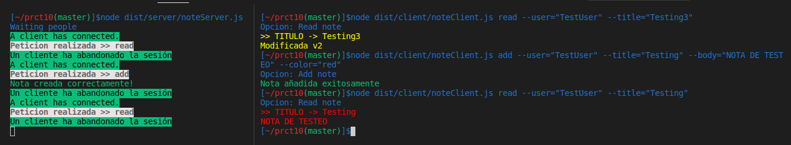

# Práctica 10 - Cliente y servidor para una aplicación de procesamiento de notas de texto

* Elaborado por Eduardo Da Silva Yanes

## Indice
- [1. Introduccion](#introduccion)
- [2. Pasos previos](#previos)
- [3. Desarrollo](#desarrollo)
- [4. Dificultades y conclusion](#conclusion)
- [5. Referencias](#referencias)

## 1. Introducción <a name="introduccion"></a>

Esta décima práctica es una evolución de la práctica 8. En este caso vamos a coger la aplicación de notas y llevarla a un siguiente nivel haciendo uso de sockets. En este caso debemos hacer un planteamiento cliente-servidor donde, desde el lado del cliente, hacemos las peticiones (añadir nota, eliminar, etc) y estas son enviadas y procesadas por el servidor. El resultado de esta operación es devuelto y mostrado al cliente. Esto es lo que se conoce como patrón **petición-respuesta**.

Además de todo el código a desarrollar, también vamos a trabajar con Github Actions y la integración continua. Tendremos ejecución continua de código TS ejecutado en Node.js y configuracioń del flujo de trabajo para trabajar con Coveralls y SonarCloud.

## 2. Pasos previos <a name="previos"></a>

Para la realización de esta práctica necesitaremos hacer uso de distintos paquetes que instalaremos a continuación.
Recordemos siempre instalar las cosas como dependencias de desarrollo. Para ello hacemos uso del flag `--save-dev`.

Para poder aprovechar la **api síncrona de Node.JS para trabajar con ficheros** debemos instalar el siguiente paquete:
```bash
npm install --save-dev @types/node
```
Para instalar **chalk** debemos hacer lo siguiente:
```bash
npm install --save-dev chalk
```
Finalmente necesitamos instalar **yargs**. Para ello debemos instalar tanto el propio yargs como el paquete **@types/yargs**. 
```bash
npm install --save-dev yargs @types/yargs
```

## 3. Desarrollo de los ejercicios <a name="desarrollo"></a>

- **[Enlace al código fuente](https://github.com/ULL-ESIT-INF-DSI-2021/ull-esit-inf-dsi-20-21-prct10-async-sockets-EduardoSY/tree/master/src)**

- **[Enlace a los tests](https://github.com/ULL-ESIT-INF-DSI-2021/ull-esit-inf-dsi-20-21-prct10-async-sockets-EduardoSY/tree/master/tests)**

- **[Enlace a la documentación generada](https://ull-esit-inf-dsi-2021.github.io/ull-esit-inf-dsi-20-21-prct10-async-sockets-EduardoSY/docum/index)**

### PARTE CLIENTE

Lo primero que hacemos es establecer la conexión con el servidor por el puerto 60300. Para ello hacemos uso del comando 

```typescript
const client = connect({port: 60300});
```

Con esto se ha guardado el socket en la constante **client**.

Con **yargs** definimos los comandos necesarios para cada una de las acciones. Estos comandos no han cambiado. La única diferencia respecto a la práctica anterior se encuentra en qué comandos ejecutan estos. Pongamos como ejemplo el comando **add**.

```typescript
yargs.command({
  command: 'add',
  describe: 'Add a new note',
  builder: {
    user: {
      describe: 'User name',
      demandOption: true,
      type: 'string',
    },
    title: {
      describe: 'Note title',
      demandOption: true,
      type: 'string',
    },
    body: {
      describe: 'Note body',
      demandOption: true,
      type: 'string',
    },
    color: {
      describe: 'Note color',
      demandOption: true,
      type: 'string',
    },
  },
  handler(argv) {
    if (typeof argv.user === 'string' && typeof argv.title === 'string' &&
    typeof argv.body === 'string' && typeof argv.color === 'string') {
      const inputData: RequestType = {
        type: 'add',
        user: argv.user,
        title: argv.title,
        body: argv.body,
        color: argv.color,
      };
      console.log('Opcion: Add note');
      client.write(`${JSON.stringify(inputData)}\n`);
    } else {
      console.log(chalk.red('ERROR: Argumentos no validos'));
    }
  },
});
```

Una vez definimos la estructura del comando, creamos una constante que implementa un objeto JSON definido en **RequestType**. Este tipo de dato, definido en `messageType.ts` nos presenta la estructura de dato que será enviada al servidor.

`RequestType` tiene como parámetros obligatorios el tipo de petición que hacemos y sobre ué **usuario** se realiza. El resto de parámetros son opcionales (dependiendo de la consulta serán necesarios o no).

Una vez definido esto enviamos al servidor la información con el comando `write`. Esta información no la podemos pasar tal cual la hemos definido. La debemos pasar de un objeto JSON a un string. Por tanto usamos la opción `stringify`. Además de esto, al final del string añadimos un **\n**. Este salto de línea será el indicador de que el mensaje ha acabado. Con esto estaríamos cumpliendo la parte de **petición** del patrón *peticioń-respuesta*.

¿Por qué uso **\n** en lugar de, por ejemplo, el método `end` para indicar que ya he terminado de enviar la petición? Si hicieramos esto el servidor no podŕia mandarnos una respuesta de vuelta al cliente en dicho socket. Por lo tanto la opción de `end` se descarta.

Una vez enviada la petición se debe esperar a que el **servidor la procese** y **devuelva una respuesta.**

La respuesta obtenida por el servidor es manejada gracias una clase creada a partir de la clase **EventEmitter**. Esta clase es `MessageEventEmitterClient`, definida en el fichero `eventEmitterClient.ts`.

Esta clase obtiene como parámetro la conexión que hemos establecido previamente. La funcionalidad de esta es recoger todos los trozos de mensaje que envie el servidor hasta que encontremos el **\n** que se nombró pocas lineas arriba. Esos trozos son los **dataChunk**, que se van agrupando en **wholeData**.

Una vez encontrado ese caracter de salto de línea **emitimos un evento** que, en este caso hemos denominado **message**. Este evento emitido será manejado posteriormente en el fichero `noteClient.ts`.

```typescript
export class MessageEventEmitterClient extends EventEmitter {
  constructor(connection: EventEmitter) {
    super();

    let wholeData = '';
    connection.on('data', (dataChunk) => {
      wholeData += dataChunk;

      let messageLimit = wholeData.indexOf('\n');
      while (messageLimit !== -1) {
        const message = wholeData.substring(0, messageLimit);
        wholeData = wholeData.substring(messageLimit + 1);
        this.emit('message', JSON.parse(message));
        messageLimit = wholeData.indexOf('\n');
      }
    });
  }
}
```

¿Por qué es necesaria esta clase? Cuando el servidor envia un mensaje, lo más común es que este se envie completo y sin ningún problema. Sin embargo, supongamos que no es así. Que el mensaje se envía fraccionado o que ha habido un error momentaneo en la conexión. Gracias a este método podemos obtener todos los trozos y formar el mensaje completo.

Otra opción es que podríamos haber implementado directamente el codigo de esta clase en el fichero, tal y como hemos hecho con el servidor.

Ahora vemos cómo se analiza el evento **message**.

```typescript
const clientMSEC = new MessageEventEmitterClient(client);

clientMSEC.on('message', (message) => {
  switch (message.type) {
    case 'add':
      if (message.status) {
        console.log(chalk.green('Nota añadida exitosamente'));
      } else {
        console.log(chalk.red('La nota no pudo ser añadida'));
      }
      break;
    case 'remove':
      if (message.status) {
        console.log(chalk.green('Nota eliminada exitosamente'));
      } else {
        console.log(chalk.red('La nota no pudo ser eliminada'));
      }
      break;
    case 'modify':
      if (message.status) {
        console.log(chalk.green('Nota modificada exitosamente'));
      } else {
        console.log(chalk.red('La nota no pudo ser modificada'));
      }
      break;
    case 'read':
      if (message.status) {
        let nota = message.notas[0];
        let notaObj = JSON.parse(nota);
        console.log(chalk.keyword(notaObj.color)('>> TITULO -> ' +
          notaObj.title));
        console.log(chalk.keyword(notaObj.color)(notaObj.body));
      } else {
        console.log(chalk.red('La nota no pudo ser leida'));
      }
      break;
    case 'listar':
      if (message.status) {
        console.log(chalk.bgWhite.black('## NOTAS ENCONTRADAS ##'));
        let aux: string[] = message.notas;
        aux.forEach( (elemento) => {
          let notaObj = JSON.parse(elemento);
          console.log(chalk.keyword(notaObj.color)(notaObj.title));
        });
      }
      break;
  }
});
```

Si analizamos bien en la clase **MessageEventEmitterClient**, cuando emitimos el evento, además emitimos la información recibida transformada a formato JSON válido. Entonces, al manejar el evento **message** hacemos uso de las propiedades de este. Con un **switch-case** diferenciamos el tipo de respuesta en base al atributo **type**. Dependiendo de cuaĺ sea se muestra un mensaje o determinada información.

### PARTE SERVIDOR

Lo primero que hacemos cuando se realiza una conexión es indicar precisamente eso, que algún cliente se ha conectado con el servidor.
Una vez hecho esto, al igual que se hizo con la clase **MessageEventEmitterClient**, se recogen los fragmentos de mensajes enviados por el cliente.

Una vez todos los ''trozos'' del mensaje están almacenados en **wholeData** se emite un evento **request** junto con la información recibida en formato JSON.

```typescript
  console.log(chalk.bgGreen.black('A client has connected.'));

  let wholeData = '';
  connection.on('data', (dataChunk) => {
    wholeData += dataChunk;

    let messageLimit = wholeData.indexOf("\n");
    while (messageLimit !== -1) {
      const message = wholeData.substring(0, messageLimit);
      wholeData = wholeData.substring(messageLimit + 1);
      connection.emit('request', JSON.parse(message));
      messageLimit = wholeData.indexOf('\n');
    }
  });
```

A continuación atendemos el evento **Request**. Cuando se recibe este tipo de eventos lo primero que hacemos es mostrar qué tipo de petición ha sido. Esto es util tanto para conocer qué está procesando el servidor como para realizar debugging.

Con un switch, gracias a la propiedad **type** que tenemos en el objeto JSON podemos distinguir qué se desea hacer con la petición. A continuación tenemos un fragmento del código (no se ha puedo todo para evitar que ocupe demasiado espacio). En ese ejemplo tenemos la funcion **add**.

Si quieremos añadir una nota llamamos a la función `addNote` pasandole los parámetros recibidos en el objeto JSON de título, cuerpo y color. 

Las funciones para interactuar con las notas han sido modificadas de tal manera que devuelvan un booleano indicando si la operación ha sido satisfactoria o no.

Este valor lo guardamos en la variable **status**. Esta nos dirá si el comando se ha efectuado correctamente o no.
A continuación creamos una constante de tipo **ResponseType**. Este tipo de dato, definido en `messageType.ts` nos presenta la estructura de dato que será enviada desde servidor al cliente como respuesta. Le indicamos el tipo de operación realizada (es el mismo tipo que el de la petición/request) y el resultado de la operación, que habíamos guardado en **status**.

En caso de que la función devuelva una nota o un listado, tenemos también un atributo formado por un array de strings destinado para almacenarlos.

Una vez hemos credo el tipo de dato debemos enviarlo al cliente haciendo uso de `write`. Al igual que se hizo para enviar la petición del cliente al servidor, la constante, que tiene formato JSON, debemos pasarla a string y añadirle además el **\n** para indicar que el mensaje está completo.

Si al enviar la petición no ha habido ningún error cerramos la conexión del cliente con el servidor. Si el cliente quiere hacer una nueva petición deberá crear una nueva conexión. Con esto ya cumpliriamos la parte de respuesta del patrón *petición-respuesta*.

```typescript
connection.on('request', (message) => {
    // console.log('DEBUG: Emit emitido y request recibido');
    console.log(chalk.bgWhite.black.bold('Peticion realizada >> ' +
      message.type));
    switch (message.type) {
      case 'add': {
        let status = noteOpt.addNote(message.user, message.title, message.body,
            message.color);
        const responseData: ResponseType = {
          type: 'add',
          status: status,
        };
        connection.write(`${JSON.stringify(responseData)}\n`, (err) => {
          if (err) {
            console.error(err);
          } else {
            connection.end();
          }
        });
      }
        break;
      case 'remove': {
        ...
        ...
        ...
```

### Ejemplo de ejecución



### Tests

Para la realización de los test tenemos tres ficheros. `note.spec.ts` y `userNoteOptions.spec.ts` corresponden a los tests realizados para la práctica 8. Aquí se comprueba tanto la correcta creación y manipulación de notas a nivel individual como el correcto funcionamiento de las funciones implementadas.

Estos tests han sufrido unos pequeños cambios debido a que, como se ha mencionado previamente, se ha modificado los valores de retorno de las funciones.

El fichero `eventEmitterClient.spec.ts` es nuevo. En este se comprueba que la recepción de la inrformacion es correcta a pesar de fraccionarse el mensaje en distintos trozos y mandarse por separado.

Este es **[el directorio con los tests del programa](https://github.com/ULL-ESIT-INF-DSI-2021/ull-esit-inf-dsi-20-21-prct10-async-sockets-EduardoSY/tree/master/tests)**

## 4. Dificultades y conclusión <a name="conclusion"></a>

Es bantante satisfactorio ver como, a partir de trabajos anteriores, vamos mejorandolos y haciendo cosas cada vez más interesantes, como es el caso de separar la aplicación en servidor y cliente.

A nivel general no han habido grandes complicaciones. Sin embargo, a la hora de realizar la implementación del comando 'list' en la parte del cliente, pasé un tiempo considerable para resolver una series de problemas con las llamadas de la función. Tras limpiar el código descubrí que un argumento que estaba pasando al console.log era el culpable de ello. De resto, la implementación ha sido bastante fluida.

Aunque el código es funcional tal y como se indica en la práctica, soy consciente de que es bastante mejorable y optimizable.

## 5. Referencias <a name="referencias"></a>

- [Guión práctica 10](https://ull-esit-inf-dsi-2021.github.io/prct10-async-sockets/): Guión de la práctica .
- [Apuntes sobre Node.js](https://ull-esit-inf-dsi-2021.github.io/nodejs-theory/): Apuntes de la asignatura sobre Node.JS
- [Apuntes sobre sockets](https://ull-esit-inf-dsi-2021.github.io/nodejs-theory/nodejs-sockets.html): Apuntes de la asignatura sobre Sockets
- [Guía para crear un proyecto](https://ull-esit-inf-dsi-2021.github.io/typescript-theory/typescript-project-setup.html): Guía del profesor para crear un proyecto.
- Diversos videotutoriales creados por el profesor de la asignatura donde explica cómo instalar diversos paquetes y configuraciones (Typedoc, Mocha, Chai, Instanbul, Workflow con Github Actions, etc.)
- [Workflow GH Actions Sonar-Cloud (Solo alumnos ULL)](https://drive.google.com/file/d/1FLPargdPBX6JaJ_85jNsRzxe34sMi-Z3/view)
- [Workflow GH Actions Coveralls (Solo alumnos ULL)](https://drive.google.com/file/d/1yOonmpVbOyvzx3ZbXMQTAPxvA3a7AE7w/view)
- [CI de código Typescript ejecutado en Node.js (Solo alumnos ULL)](https://drive.google.com/file/d/1hwtPovQlGvthaE7e7yYshC4v8rOtLSw0/view)
- [Yargs. Pagina oficial npm](https://www.npmjs.com/package/yargs)
- [Chalk. Pagina oficial npm](https://www.npmjs.com/package/chalk)
